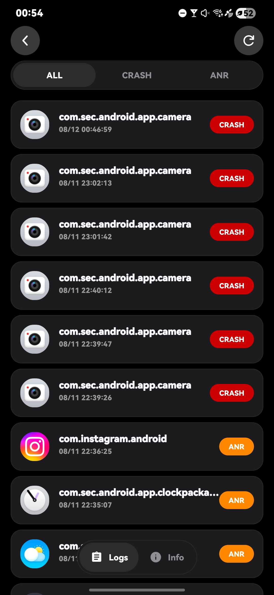
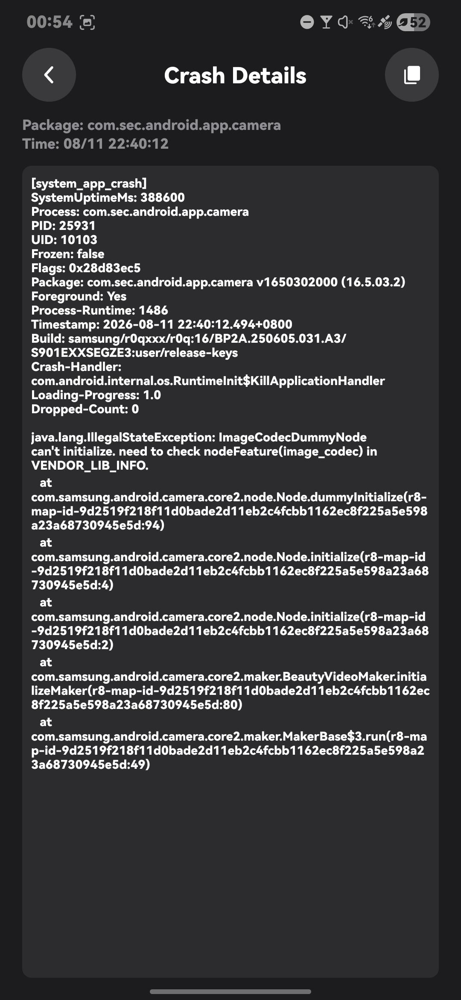
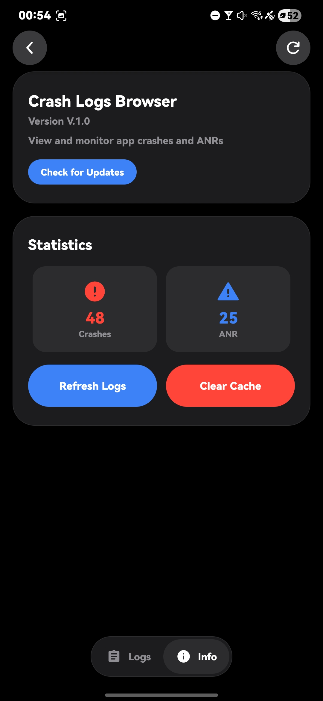
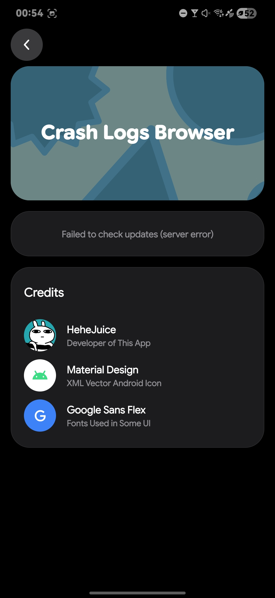

# Crash Logs Browser

> A Simple / Light-Weight Android Crash or ANRs Logs Viewer 

## Badges

## Features 

> Viewing Crashes and ANRs

> Support adb command or Root to grant permission for the app

## Screenshots

  
  
  
  

## Acknowledgements

> This project uses codes from the following projects 

> [Google / Google Sans Flex](https://design.google/library/google-sans-flex-font)

> [Google / Material Design Icons](https://m3.material.io/styles/icons)

## Join Us

