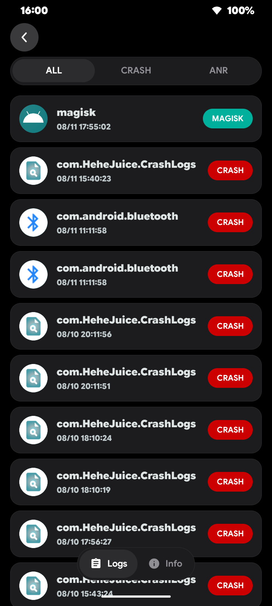
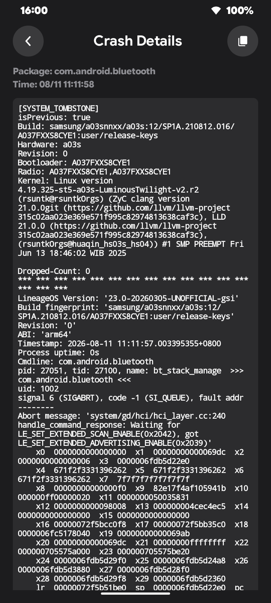
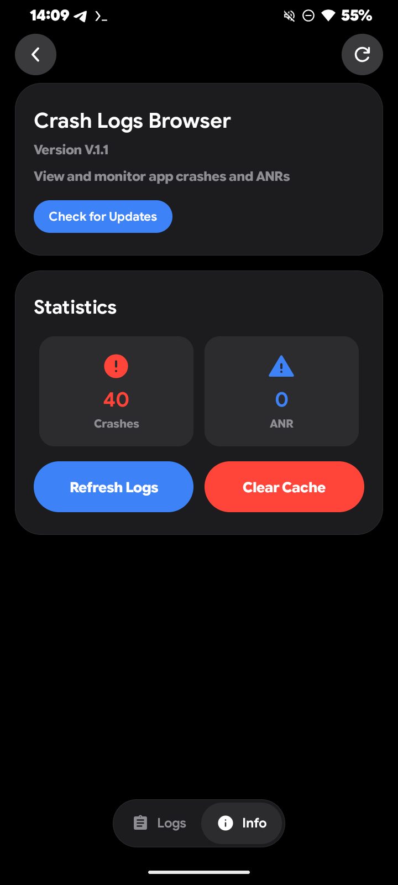
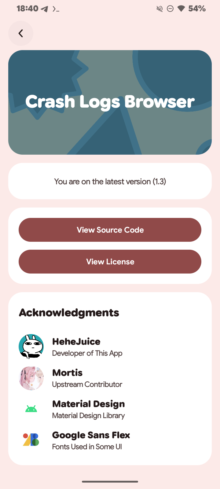

# Crash Logs Browser
> A Simple / Light-Weight Android Crash or ANRs Logs Viewer 

> Android 13 and Up

> Support adb command or Root to grant permission for the app

## Screenshots

  
  
  
  

## Acknowledgements

This project uses codes from the following projects 

[Google / Google Sans Flex](https://design.google/library/google-sans-flex-font)

[Google / Material Design Icons](https://m3.material.io/styles/icons)

